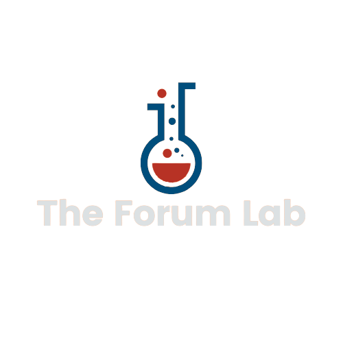

<!-- # Example app with [chakra-ui](https://github.com/chakra-ui/chakra-ui)

This example features how to use [chakra-ui](https://github.com/chakra-ui/chakra-ui) as the component library within a Next.js app.

We are connecting the Next.js `_app.js` with `chakra-ui`'s Theme and ColorMode containers so the pages can have app-wide dark/light mode. We are also creating some components which shows the usage of `chakra-ui`'s style props.

## Preview

Preview the example live on [StackBlitz](http://stackblitz.com/):

[](https://stackblitz.com/github/vercel/next.js/tree/canary/examples/with-chakra-ui)

## Deploy your own

Deploy the example using [Vercel](https://vercel.com?utm_source=github&utm_medium=readme&utm_campaign=next-example):

[](https://vercel.com/new/git/external?repository-url=https://github.com/vercel/next.js/tree/canary/examples/with-chakra-ui&project-name=with-chakra-ui&repository-name=with-chakra-ui)

## How to use

Execute [`create-next-app`](https://github.com/vercel/next.js/tree/canary/packages/create-next-app) with [npm](https://docs.npmjs.com/cli/init) or [Yarn](https://yarnpkg.com/lang/en/docs/cli/create/) to bootstrap the example:

```bash
npx create-next-app --example with-chakra-ui with-chakra-ui-app
# or
yarn create next-app --example with-chakra-ui with-chakra-ui-app
```

Deploy it to the cloud with [Vercel](https://vercel.com/new?utm_source=github&utm_medium=readme&utm_campaign=next-example) ([Documentation](https://nextjs.org/docs/deployment)).

## Notes

Chakra has supported Gradients and RTL in `v1.1`. To utilize RTL, [add RTL direction and swap](https://chakra-ui.com/docs/features/rtl-support).

If you don't have multi-direction app, you should make `<Html lang="ar" dir="rtl">` inside `_document.js`. -->

<div id="top"></div>
<!--
*** Thanks for checking out the The-Forum-Lab. If you have a suggestion
*** that would make this better, please fork the repo and create a pull request
*** or simply open an issue with the tag "enhancement".
*** Don't forget to give the project a star!
*** Thanks again! Now go create something AMAZING! :D
-->

<!-- PROJECT SHIELDS -->
<!--
*** I'm using markdown "reference style" links for readability.
*** Reference links are enclosed in brackets [ ] instead of parentheses ( ).
*** See the bottom of this document for the declaration of the reference variables
*** for contributors-url, forks-url, etc. This is an optional, concise syntax you may use.
*** https://www.markdownguide.org/basic-syntax/#reference-style-links
-->

[![Contributors][contributors-shield]][contributors-url]
[![Forks][forks-shield]][forks-url]
[![Stargazers][stars-shield]][stars-url]
[![Issues][issues-shield]][issues-url]
[![LinkedIn][linkedin-shield]][linkedin-url]

<!-- PROJECT LOGO -->
<br />
<div align="center">
  
  

  <h3 align="center">The Forum Lab is an online community where users can share ideas that can be voted up or down by other members.</h3>

  <p align="center">
    <br />
    <a href="https://github.com/ej1seven/The-Forum-Lab"><strong>Explore the docs »</strong></a>
    <br />
    <br />
    <a href="https://theforumlab.com/">View Demo</a>
    ·
    <a href="https://github.com/ej1seven/The-Forum-Lab/issues">Report Bug</a>
    ·
    <a href="https://github.com/ej1seven/The-Forum-Lab/issues">Request Feature</a>
  </p>
</div>

<!-- TABLE OF CONTENTS -->
<details>
  <summary>Table of Contents</summary>
  <ol>
    <li>
      <a href="#about-the-project">About The Project</a>
      <ul>
        <li><a href="#built-with">Built With</a></li>
      </ul>
    </li>
    <li>
      <a href="#getting-started">Getting Started</a>
      <ul>
        <li><a href="#prerequisites">Prerequisites</a></li>
        <li><a href="#installation">Installation</a></li>
      </ul>
    </li>
    <li><a href="#usage">Usage</a></li>
    <li><a href="#roadmap">Roadmap</a></li>
    <li><a href="#contributing">Contributing</a></li>
    <li><a href="#license">License</a></li>
    <li><a href="#contact">Contact</a></li>
    <li><a href="#acknowledgments">Acknowledgments</a></li>
  </ol>
</details>

<!-- ABOUT THE PROJECT -->

## About The Project

Social media is an integral part of our lives, and many of us seek a place to express ourselves. The Forum Lab provides a platform for users to post content that may be voted upon by other members. Contrary to many other discussion forums, The Forum Lab does not allow users to post comments. The reason behind this is to remove the negativity that comes along with comments. Instead we allow members to vote up or down on a post. This feedback provides the owner with a sense of the acceptance rate.

<p align="right">(<a href="#top">back to top</a>)</p>

### Built With

- [Next.js](https://nextjs.org/)
- [React.js](https://reactjs.org/)
- [Node.js](https://nodejs.org/)
- [Express.js](https://expressjs.com/)
- [Chakra](https://chakra-ui.com/)
- [FontAwesome](https://fontawesome.com/)
- [GraphQl](https:///graphql.org/)
- [ApolloServer](https://www.apollographql.com/)
- [Postgresql](https://postgresql.org/)
- [Redis](https://redis.io/)
- [Nodemailer](https://nodemailer.com/)
- [Typescript](https://typescriptlang.org/)
- [Docker](https://www.docker.com/)
- [Urql](https://formidable.com/open-source/urql/)
- [MikroOrm](https://mikro-orm.io/)
- [Argon2](https://www.npmjs.com/package/argon2)
- [Dataloader](https://www.npmjs.com/package/dataloader)
- [Vercel](https://vercel.com/)

<p align="right">(<a href="#top">back to top</a>)</p>

<!-- GETTING STARTED -->

## Getting Started

To get a local copy up and running follow these simple example steps.

````

### Installation

1. Clone the repo
 ```sh
 git clone https://github.com/Ej1seven/The-Forum-Lab.git
````

2. Install NPM packages
   ```sh
   npm install
   ```
3. Create `.env` file for web
   ```js
   NEXT_PUBLIC_API_URL = put - your - graphql - api - url;
   ```

````

4. Create `.env` file for server

   ```js
   DATABASE_URL=put-in-your-postgres-database-url
   REDIS_URL=put-your-redis-url
   PORT=put-your-server-port-number
   SESSION_SECRET=put-your-session-password
   CORS_ORIGIN=put-your-localhost-url

   ```

5. Create `.env.production` file for server

   ```js
   SESSION_SECRET = put - your - session - password;
   CORS_ORIGIN = put - your - production - website - url;
   ```

<p align="right">(<a href="#top">back to top</a>)</p>

<!-- USAGE EXAMPLES -->

## Usage

Use this space to show useful examples of how a project can be used. Additional screenshots, code examples and demos work well in this space. You may also link to more resources.

_For more examples, please refer to the [Documentation](https://example.com)_

<p align="right">(<a href="#top">back to top</a>)</p>

<!-- ROADMAP -->

## Roadmap

- [x] Add Changelog
- [x] Add back to top links
- [ ] Add Additional Templates w/ Examples
- [ ] Add "components" document to easily copy & paste sections of the readme
- [ ] Multi-language Support
  - [ ] Chinese
  - [ ] Spanish

See the [open issues](https://github.com/ej1seven/The-Forum-Lab/issues) for a full list of proposed features (and known issues).

<p align="right">(<a href="#top">back to top</a>)</p>

<!-- CONTRIBUTING -->

## Contributing

Contributions are what make the open source community such an amazing place to learn, inspire, and create. Any contributions you make are **greatly appreciated**.

If you have a suggestion that would make this better, please fork the repo and create a pull request. You can also simply open an issue with the tag "enhancement".
Don't forget to give the project a star! Thanks again!

1. Fork the Project
2. Create your Feature Branch (`git checkout -b feature/AmazingFeature`)
3. Commit your Changes (`git commit -m 'Add some AmazingFeature'`)
4. Push to the Branch (`git push origin feature/AmazingFeature`)
5. Open a Pull Request

<p align="right">(<a href="#top">back to top</a>)</p>

<!-- LICENSE -->

## License

Distributed under the MIT License. See `LICENSE.txt` for more information.

<p align="right">(<a href="#top">back to top</a>)</p>

<!-- CONTACT -->

## Contact

Your Name - [@your_twitter](https://twitter.com/your_username) - email@example.com

Project Link: [https://github.com/your_username/repo_name](https://github.com/your_username/repo_name)

<p align="right">(<a href="#top">back to top</a>)</p>

<!-- ACKNOWLEDGMENTS -->

## Acknowledgments

Use this space to list resources you find helpful and would like to give credit to. I've included a few of my favorites to kick things off!

- [Choose an Open Source License](https://choosealicense.com)
- [GitHub Emoji Cheat Sheet](https://www.webpagefx.com/tools/emoji-cheat-sheet)
- [Malven's Flexbox Cheatsheet](https://flexbox.malven.co/)
- [Malven's Grid Cheatsheet](https://grid.malven.co/)
- [Img Shields](https://shields.io)
- [GitHub Pages](https://pages.github.com)
- [Font Awesome](https://fontawesome.com)
- [React Icons](https://react-icons.github.io/react-icons/search)

<p align="right">(<a href="#top">back to top</a>)</p>

<!-- MARKDOWN LINKS & IMAGES -->
<!-- https://www.markdownguide.org/basic-syntax/#reference-style-links -->

[contributors-shield]: https://img.shields.io/github/contributors/ej1seven/The-Forum-Lab?style=plastic
[contributors-url]: https://github.com/ej1seven/The-Forum-Lab/graphs/contributors
[forks-shield]: https://img.shields.io/github/forks/ej1seven/The-Forum-Lab.svg?style=plastic
[forks-url]: https://github.com/ej1seven/The-Forum-Lab/network/members
[stars-shield]: https://img.shields.io/github/stars/ej1seven/The-Forum-Lab.svg?style=plastic
[stars-url]: https://github.com/ej1seven/The-Forum-Lab/stargazers
[issues-shield]: https://img.shields.io/github/issues/ej1seven/The-Forum-Lab.svg?style=plastic
[issues-url]: https://github.com/ej1seven/The-Forum-Lab/issues
[linkedin-shield]: https://img.shields.io/badge/-LinkedIn-black.svg?style=plastic&logo=linkedin&colorB=555
[linkedin-url]: https://linkedin.com/in/erik-hunter/
[product-screenshot]: images/screenshot.png

```

```

```

```
````
